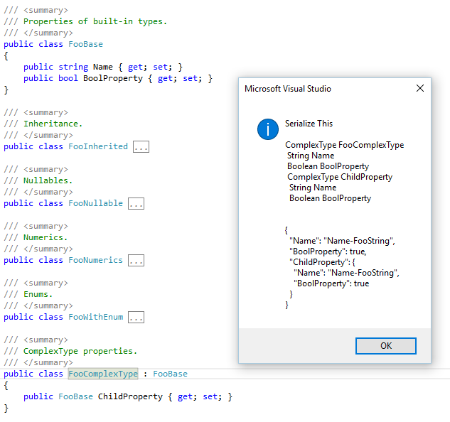

# CodeCaster.SerializeThis

## Introduction

SerializeThis is a Visual Studio Extension. It lets you generate an example JSON for a class by right-clicking a type name. This can be helpful to generate example JSON to use in unit tests or through a REST client such as [Postman](https://www.getpostman.com/).

This is not meant as a replacement for documentation and client generators such as [Swagger](http://swagger.io/).

It currently looks like this:

The extension does not yet output anything. Perhaps it could copy the serialized object to the clipboard, or open a new tab in the text editor and write the serialized object into it. 

## Building and Running

This project is a Visual Studio Extension, so you'll need to install the [Visual Studio SDK](https://msdn.microsoft.com/en-us/library/mt683786.aspx) in order to compile it. The startup project requres Visual Studio 2017 to open and build, but the Extension will work in Visual Studio 2015 and 2017.  

When running it, it starts an experimental instance of Visual Studio, where the extension will be loaded.

